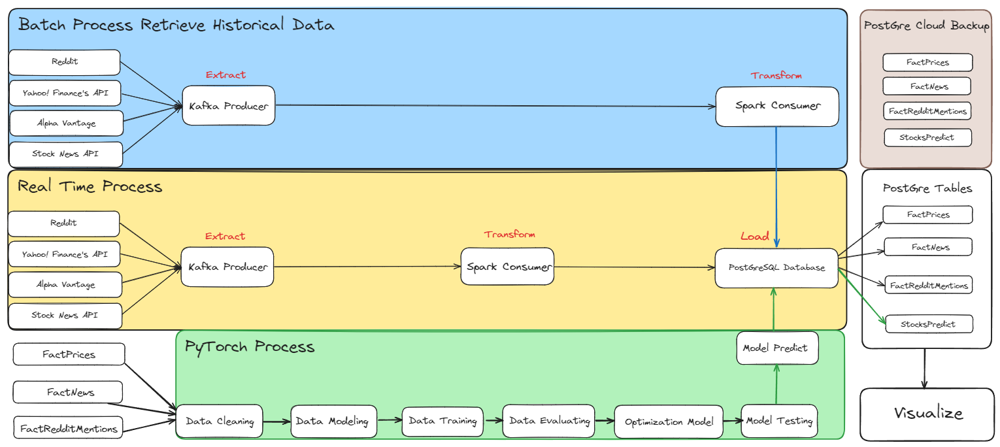
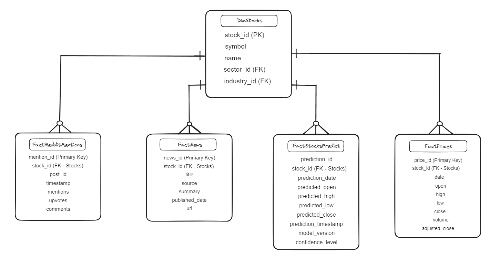

# Deep Learning Quant Trading
The primary objective of this project is to develop and implement a Long Short-Term Memory (LSTM) deep learning model for quantitative trading. This model aims to leverage historical and real-time financial data to predict stock prices accurately, thereby enabling the execution of profitable trading strategies. The project will focus on integrating multiple data sources, cleaning and processing the data, training the LSTM model, and deploying it in a real-time trading environment.

---

## I. Usage
### A. Set Up

<details><summary><strong> 1. Create Virtual Environment (Python 3.8) </strong></summary>

* If you want to create a new virtual enviroment, you can use the following command in the terminal of the project directory:

  * In Windows or Linux, you can use the following command:
  
  ```bash
    python -m venv venv
  ```

  * Then, you can activate the virtual enviroment by using the following command:
  
  ```bash
    venv\Scripts\activate
  ```

  * In MacOs, you can use the following command:
  
  ```bash
    python3 -m venv venv
  ```

  * Then, you can activate the virtual enviroment by using the following command:
  
  ```bash
    source venv/Scripts/activate
  ```

* Make sure the virtual environment needed for project is activate with corresponding project directory, you can use the following command:

  * In Windows or Linux, you can use the following command:
  
  ```bash
    venv\Scripts\activate
  ```

  * In MacOs, you can use the following command:
  
  ```bash
    source venv/Scripts/activate
  ```

</br>
</details>

<details><summary><strong> 2. Install Dependencies </strong></summary>
<p>
Install requirements.txt: Automatically installed dependencies that needed for the project:
  
  ```bash
    pip install -r requirements.txt
  ```
  or
  ```bash
    pip install streamlit, pyspark, yfinance, psycopg2, python-dotenv
  ```
</p>
</details>

### B. Set Up Documents
1. Spark: https://medium.com/@ansabiqbal/setting-up-apache-spark-pyspark-on-windows-11-machine-e16b7382624a
2. Kafka: [https://github.com/NolanMM/Notebook-Practice-NolanM/blob/master/Set Up Tool For Data/Windows11/Kafka/Set Up Kafka Instruction.ipynb](https://github.com/NolanMM/Notebook-Practice-NolanM/blob/master/Set%20Up%20Tool%20For%20Data/Windows11/Kafka/Set%20Up%20Kafka%20Instruction.ipynb)
3. PostgreSQL: https://medium.com/@Abhisek_Sahu/installing-postgresql-on-windows-for-sql-practices-671212203e9b
4. PyTorch: https://pytorch.org/get-started/locally/

---

## II. High Level Design


<details><summary><strong> Details </strong></summary>

### 1.Data Sources

- **Reddit:** For extracting sentiment data related to stock mentions.
- **Yahoo Finance API:** For obtaining historical and real-time stock prices and financial data.
- **Alpha Vantage:** For additional financial data and technical indicators.
- **Stock News API:** For news articles and headlines related to stocks.

### 2.Data Processing

- **Kafka:** Used as a producer to extract data from various sources.
- **Apache Spark:** Used for data transformation and processing, both in batch and real-time.

### 3.Data Storage

- **PostgreSQL Database:** Centralized storage for processed data including stock prices, news, Reddit mentions, and predictions.

### 4.Machine Learning

- **PyTorch:** For building, training, and evaluating the LSTM deep learning model.

### 5.Visualization

- **Streamlit:** To visualize model predictions, trading performance, and generate interactive reports.

### 6.Backup and Maintenance (Optional)

- **PostgreSQL Cloud Backup:** For regular data and model backups to ensure data integrity and availability.
- **System Monitoring:** Continuous monitoring and maintenance of the system to handle issues and improve performance
</details>

## III. Database Schema

<details><summary><strong> We applying star schema architecture database include </strong></summary>

### Central Fact Table

- **DimStocks**: This is the central fact table containing information about stocks. It includes the following fields:
    - **stock_id (PK)**: Primary Key, a unique identifier for each stock.
    - **symbol**: The stock ticker symbol.
    - **name**: The full name of the stock.
    - **sector_id (FK)**: Foreign Key, links to the sector dimension.
    - **industry_id (FK)**: Foreign Key, links to the industry dimension.

### Dimension Tables

1. **FactPrices**: Contains detailed pricing information for each stock.
    - **price_id (Primary Key)**: Unique identifier for each price entry.
    - **stock_id (FK - Stocks)**: Foreign Key, links to the central stock table.
    - **date**: The date of the price record.
    - **open, high, low, close**: The opening, highest, lowest, and closing prices of the stock.
    - **volume**: The trading volume of the stock.
    - **adjusted_close**: The adjusted closing price of the stock.
2. **FactNews**: Contains news articles and headlines related to stocks.
    - **news_id (Primary Key)**: Unique identifier for each news entry.
    - **stock_id (FK - Stocks)**: Foreign Key, links to the central stock table.
    - **title**: The title of the news article.
    - **source**: The source of the news article.
    - **summary**: A summary of the news article.
    - **published_date**: The publication date of the news article.
    - **url**: The URL link to the full news article.
3. **FactRedditMentions**: Contains data from Reddit mentions related to stocks.
    - **mention_id (Primary Key)**: Unique identifier for each Reddit mention.
    - **stock_id (FK - Stocks)**: Foreign Key, links to the central stock table.
    - **post_id**: The ID of the Reddit post.
    - **timestamp**: The timestamp of the Reddit mention.
    - **mentions**: The number of times the stock is mentioned in the post.
    - **upvotes**: The number of upvotes the Reddit post received.
    - **comments**: The number of comments on the Reddit post.
4. **FactStocksPredict**: Contains predicted stock prices generated by the LSTM model.
    - **prediction_id (Primary Key)**: Unique identifier for each prediction entry.
    - **stock_id (FK - Stocks)**: Foreign Key, links to the central stock table.
    - **prediction_date**: The date of the prediction.
    - **predicted_open, predicted_high, predicted_low, predicted_close**: Predicted opening, highest, lowest, and closing prices of the stock.
    - **prediction_timestamp**: The timestamp when the prediction was made.
    - **model_version**: The version of the model used for the prediction.
    - **confidence_level**: The confidence level of the prediction.

### **Note:**

- **Centralized Fact Table**: The DimStocks table is at the center, and all dimension tables are connected to it via foreign keys.
</details>
